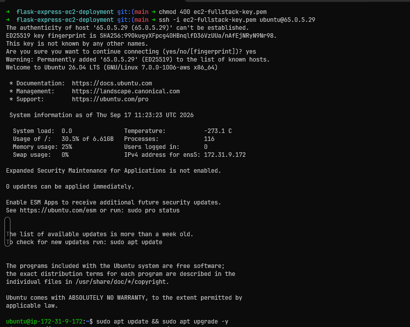
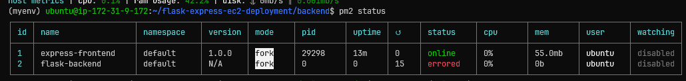
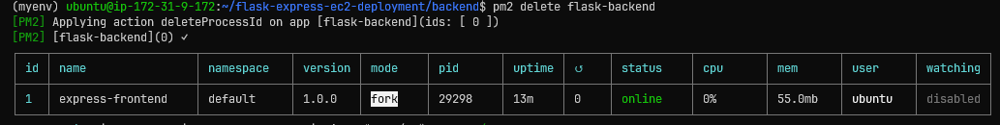
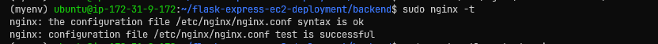
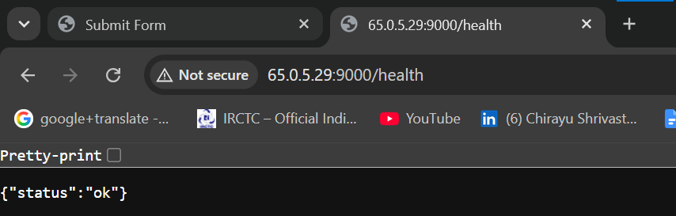
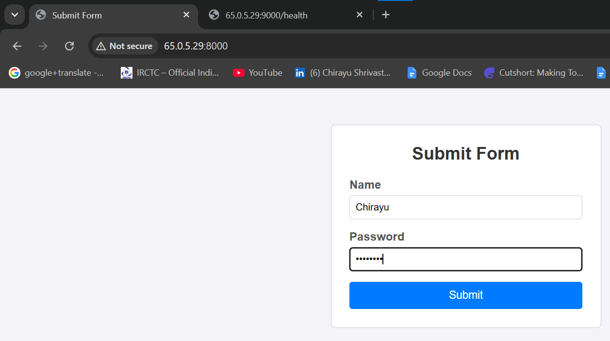
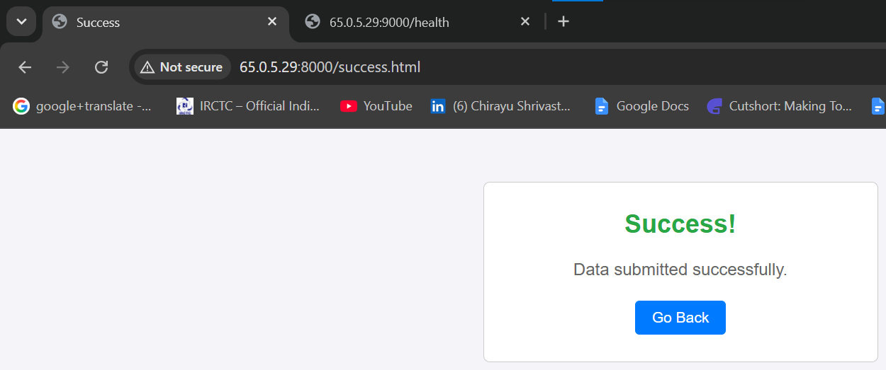

```markdown
# Full-Stack EC2 Deployment (Flask + Express + MongoDB + Nginx)

End-to-end production deployment of a full-stack application (**Flask Backend + Express Frontend + MongoDB Atlas**) on an **AWS EC2 Ubuntu 24.04 / 22.04 LTS** instance.

The application is managed with **PM2** and served through an **Nginx** reverse proxy.

---

## Architecture Overview

| Component          | Details                              |
|--------------------|--------------------------------------|
| Cloud Provider     | AWS EC2 (Ubuntu Server)              |
| Public IP          | `65.0.5.29`                          |
| Frontend           | Express.js / Node.js (Internal Port `8000`) |
| Backend            | Python Flask API (Internal Port `9000`) |
| Database           | MongoDB Atlas                        |
| Process Manager    | PM2 (daemon + auto-restart on boot)  |
| Web Server         | Nginx Reverse Proxy (Port `80`)      |

---

## Project Structure

```text
flask-express-ec2-deployment/
├── assets/                     # Deployment screenshots & images
│   ├── ssh-login.png
│   ├── backend-error-log.png
│   ├── pm2-status-online.png
│   ├── nginx-syntax-ok.png
│   ├── backend-health.png
│   ├── frontend-form.png
│   └── submission-success.png
├── backend/
│   ├── .env
│   ├── .env.example
│   ├── app.py
│   ├── Dockerfile
│   └── requirements.txt
├── frontend/
│   ├── public/
│   │   ├── index.html
│   │   └── success.html
│   ├── Dockerfile
│   ├── package.json
│   └── server.js
├── .env.example
├── .gitignore
├── docker-compose.yaml
└── README.md
```

---

## Prerequisites

- AWS EC2 instance (Ubuntu 22.04 / 24.04 LTS)
- Security Group allowing inbound traffic on ports **22** (SSH) and **80** (HTTP)
- MongoDB Atlas cluster + connection string
- PEM key for SSH access

---

## Step-by-Step Implementation

### Step 1: EC2 SSH Login & Server Preparation

Connect to the EC2 instance:

```bash
ssh -i ec2-fullstack-key.pem ubuntu@65.0.5.29
```

Update the system and install required packages:

```bash
sudo apt update && sudo apt upgrade -y
sudo apt install -y python3-pip python3-venv git nginx

# Install Node.js 20
curl -fsSL https://deb.nodesource.com/setup_20.x | sudo -E bash -
sudo apt install -y nodejs

# Install PM2 globally
sudo npm install -g pm2
```



---

### Step 2: Clone Repository

```bash
git clone https://github.com/chirayus20/flask-express-ec2-deployment.git
cd flask-express-ec2-deployment
```

---

### Step 3: Backend Setup (Flask – Port 9000)

Create an isolated Python virtual environment and install dependencies:

```bash
cd ~/flask-express-ec2-deployment/backend
python3 -m venv myenv
source myenv/bin/activate
pip install -r requirements.txt
```

**Issue Encountered**

Flask failed to start with the following error because MongoDB credentials were missing in `.env`:

```
ConfigurationError: DNS query name does not exist
```



**Fix**

1. Create / edit the `.env` file with your real MongoDB Atlas connection string:

```bash
nano .env
```

Example content:

```env
MONGO_URI=mongodb+srv://<username>:<password>@cluster.mongodb.net/<dbname>?retryWrites=true&w=majority
```

2. Start the Flask application using PM2 with the virtualenv Python binary:

```bash
pm2 start myenv/bin/python --name flask-backend -- app.py
```

---

### Step 4: Frontend Setup (Express – Port 8000)

```bash
cd ~/flask-express-ec2-deployment/frontend
npm install
pm2 start server.js --name express-frontend
```

Check that both processes are online:

```bash
pm2 status
```



---

### Step 5: Nginx Reverse Proxy Configuration

Edit the default Nginx site configuration:

```bash
sudo nano /etc/nginx/sites-available/default
```

**Full configuration:**

```nginx
server {
    listen 80;
    server_name _;

    # Frontend (Express on port 8000)
    location / {
        proxy_pass http://127.0.0.1:8000;
        proxy_http_version 1.1;
        proxy_set_header Upgrade $http_upgrade;
        proxy_set_header Connection "upgrade";
        proxy_set_header Host $host;
        proxy_cache_bypass $http_upgrade;
    }

    # Backend API (Flask on port 9000)
    location /api/ {
        proxy_pass http://127.0.0.1:9000/;
        proxy_http_version 1.1;
        proxy_set_header Host $host;
        proxy_set_header X-Real-IP $remote_addr;
        proxy_set_header X-Forwarded-For $proxy_add_x_forwarded_for;
        proxy_set_header X-Forwarded-Proto $scheme;
    }
}
```

Test the configuration and restart Nginx:

```bash
sudo nginx -t
sudo systemctl restart nginx
```



Make sure PM2 processes survive server reboots:

```bash
pm2 save
sudo env PATH=$PATH:/usr/bin pm2 startup systemd -u ubuntu --hp /home/ubuntu
```

---

## Verification & Output

### 1. Backend Health Check

```
http://65.0.5.29:9000/health  →  {"status": "ok"}
```



### 2. Frontend Form

The form is accessible on both port `8000` and via Nginx on port `80`:



### 3. Successful Submission

Form data is successfully routed through Nginx → Express → Flask and stored in MongoDB Atlas:



---

## Optional: Docker Setup

The repository also contains Dockerfiles and a `docker-compose.yaml` for containerized deployment.

```bash
# From project root
docker-compose up --build -d
```

This is useful for local testing or alternative deployment strategies.

---

## Useful PM2 Commands

| Command                    | Description                      |
|---------------------------|----------------------------------|
| `pm2 status`              | View running processes           |
| `pm2 logs`                | View combined logs               |
| `pm2 logs flask-backend`  | View Flask logs only             |
| `pm2 restart all`         | Restart all apps                 |
| `pm2 stop all`            | Stop all apps                    |
| `pm2 delete all`          | Remove all apps from PM2         |
| `pm2 save`                | Save current process list        |

---

## Security Notes

- Never commit the real `.env` file (it is already listed in `.gitignore`).
- Always use the provided `.env.example` files as templates.
- Restrict MongoDB Atlas Network Access to your EC2 public IP (or `0.0.0.0/0` only for testing).
- Keep the EC2 Security Group as restrictive as possible (only ports 22 and 80 open publicly).

---

```
